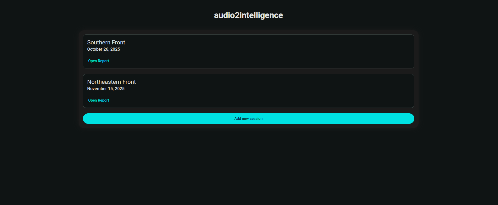
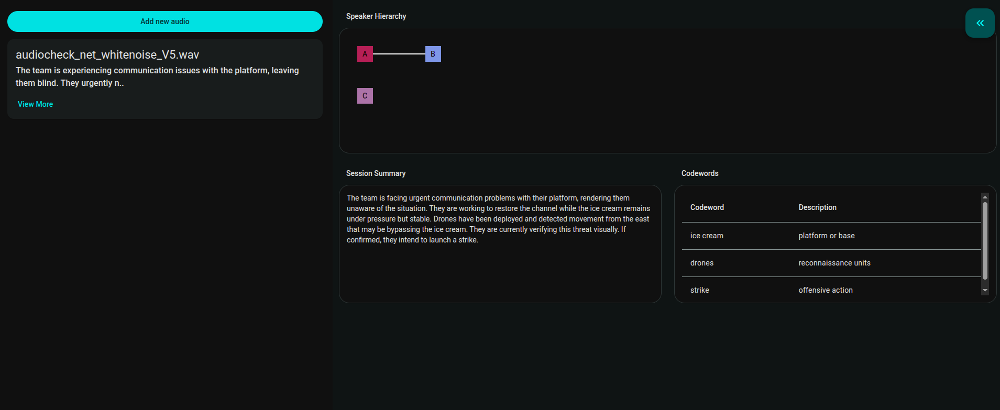
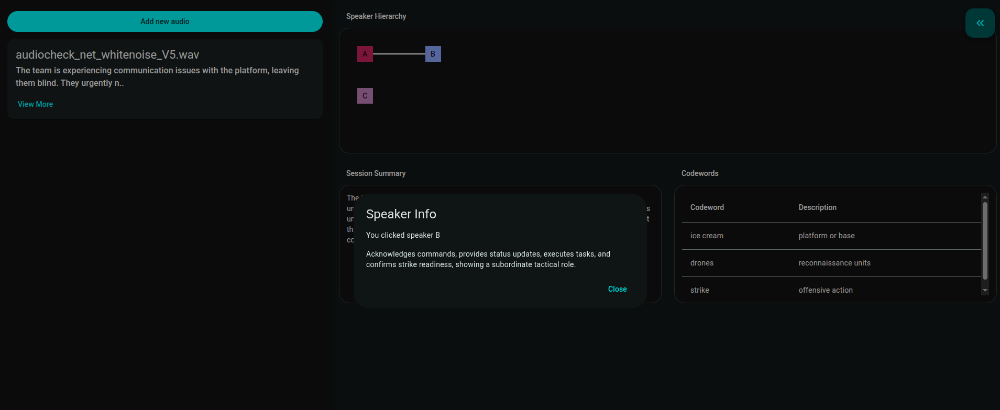
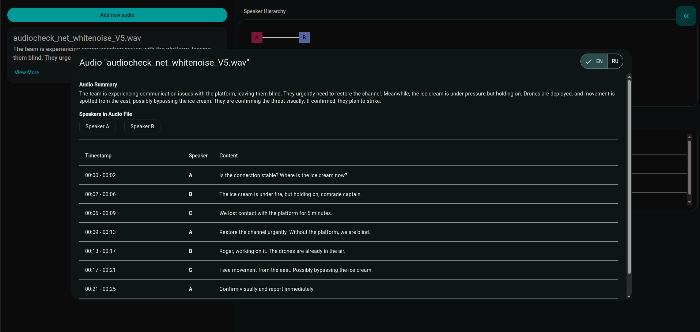

# audio2intelligence

As part of the [European Defense Tech Hackathon 2025 in Munich](https://luma.com/edth-2025-munich?tk=KQt2cz), team _Demfar_ developed _audio2intelligence_.

Given intercepted enemy radio communication, this tool extracts valuable intelligence, including:

- 🔐 Codewords
- 🧩 Speaker hierarchy
- 🗣️ Speaker descriptions
- ✍️ Text transcription

## 🚀 How to start

**Note: You will need a Hugging Face and AssemblyAI token.**

Open two terminals, one for the client and one for the server.

### Client

```
cd client
npm start
```

### Server

```
cd server
python3 -m venv .venv
source .venv/bin/activate
pip install -r requirements.txt
python server.py
```

Next, create a `.env` file in the server directory.
Copy the content from `.env.example`, then fill in your Hugging Face and AssemblyAI tokens.

## 💻 How to use

The client can be accessed by default at http://localhost:4200/.

### 📂 Sessions

The landing page shows all existing sessions and allows you to create new ones. Each session has its own isolated context, separate from others.



### 📄 Session Report

After opening the report for a session, the application displays the speaker hierarchy, session summary, extracted codewords, and uploaded audio files. It is also possible to upload further audio files by clicking the _Add new audio_ button.



### 🧑‍💼 Speaker Info

By clicking a node representing a speaker in the hierarchy graph, the speaker info pops up.



### 🎤 Speech Transcription

By pressing the _View More_ button of an audio file, the speech transcription pops up. Here, the summary of the speech is displayed, along with a diarized transcription. The user can choose to view the transcription in English or Russian.


